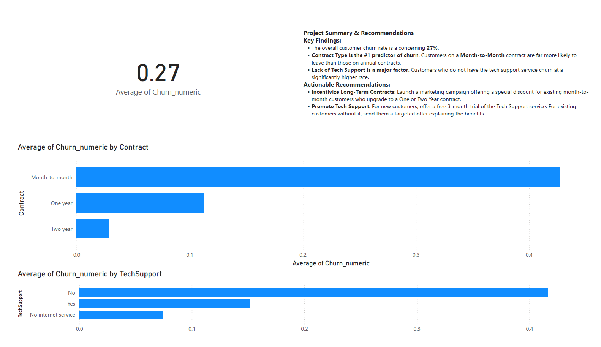

# Customer Churn Analysis and Prediction

This project analyzes a telecom dataset to identify key drivers of customer churn. The analysis includes data cleaning, building a predictive machine learning model in Python, and presenting the final results in an interactive Power BI dashboard.

## Key Findings
- Customers on **Month-to-Month contracts** and those without **Tech Support** were identified as the highest churn risks.
- A logistic regression model was built using Scikit-learn to **predict customer churn with over 82% accuracy**.

## Dashboard
Here is a screenshot of the final Power BI dashboard summarizing the historical insights.

## Tools Used
- **Python:** for data cleaning, analysis, and modeling.
  - Libraries: Pandas, Matplotlib, Seaborn, Scikit-learn
- **Jupyter Notebook:** for reproducible analysis.
- **Power BI:** for creating the final interactive dashboard.
- **Git & GitHub:** for version control and sharing.
